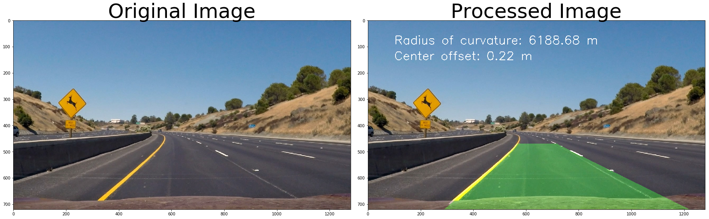
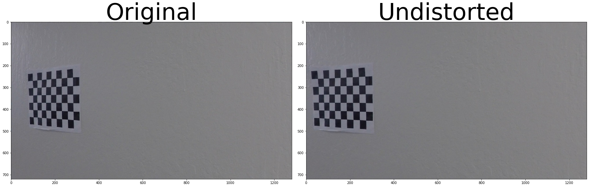
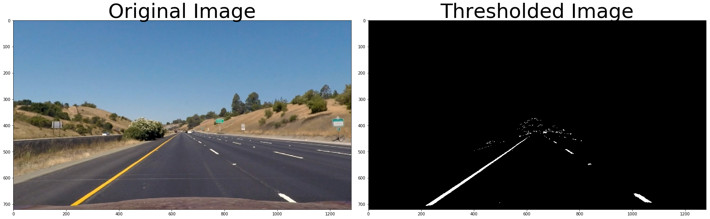
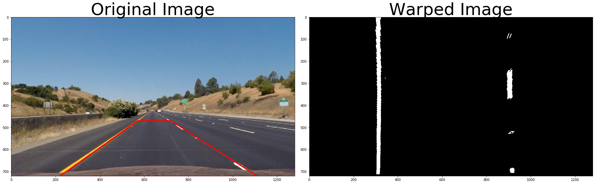
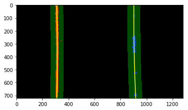
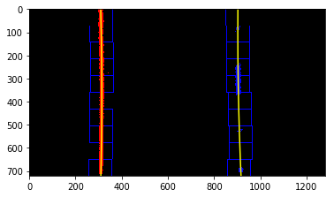
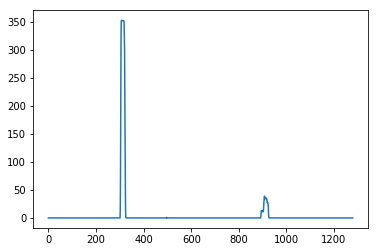
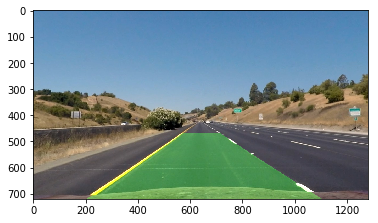

# Advanced Lane Detection


The goals / steps of this project are the following:

* Compute the camera calibration matrix and distortion coefficients given a set of chessboard images.
* Apply a distortion correction to raw images.
* Use color transforms, gradients, etc., to create a thresholded binary image.
* Apply a perspective transform to rectify binary image ("birds-eye view").
* Detect lane pixels and fit to find the lane boundary.
* Determine the curvature of the lane and vehicle position with respect to center.
* Warp the detected lane boundaries back onto the original image.
* Output visual display of the lane boundaries and numerical estimation of lane curvature and vehicle position.


### Camera Calibration

OpenCV provide some really helpful built-in functions for the task on camera calibration. First 
of all, to detect the calibration pattern in the calibration images, we can use the function `cv2.findChessboardCorners(image, pattern_size)`. 

Once we have stored the correspondeces between 3D world and 2D image points for a bunch of images, we can proceed to actually calibrate the camera through `cv2.calibrateCamera()`. Among other things, this function returns both the *camera matrix* and the *distortion coefficients*, which we can use to undistort the frames.




### Color transforms, Gradients

I used a combination of color and gradient thresholds to generate a binary image. In order to detect the white lines, I found that [equalizing the histogram](http://docs.opencv.org/3.1.0/d5/daf/tutorial_py_histogram_equalization.html) of the input frame before thresholding works really well to highlight the actual lane lines. For the yellow lines, I employed a threshold on V channel in [HSV](http://docs.opencv.org/3.2.0/df/d9d/tutorial_py_colorspaces.html) color space. Furthermore, I also convolve the input frame with Sobel kernel to get an estimate of the gradients of the lines. Finally, I make use of [morphological closure](http://docs.opencv.org/3.0-beta/doc/py_tutorials/py_imgproc/py_morphological_ops/py_morphological_ops.html) to *fill the gaps* in my binary image.


### Perspective transform


Used OpenCV to get the transform.I verified that my perspective transform was working as expected
 by drawing 
the 
`src` and 
`dst` points onto a test image and its warped counterpart to verify that the lines appear parallel in the warped image.

### Polynomial fit


In order to identify which pixels of a given binary image belong to lane-lines, we have (at least) two possibilities. If we have a brand new frame, and we never identified where the lane-lines are, we must perform an exhaustive search on the frame.
starting from the bottom of the image, precisely from the peaks location of the histogram of the binary image, we slide two windows towards the upper side of the image, deciding which pixels belong to which lane-line.


### Windows


### Curvature 
```
       ((1 + (2 * coeffs[0] * y_eval + coeffs[1]) ** 2) ** 1.5) / np.absolute(2 * coeffs[0])
```

### Histogram


### Output image


### Final output with curvature


### Videos
[test video](output_videos/project_video_output.mp4)
[challange video](output_videos/challenge_video_output.mp4)


# Deep Learning Approach

In this Repo, Deep Learning approach is going to be used instead of just Image Processing / video processing like [Self-Driving-Car-LaneDetection](https://github.com/shangeth/Self-Driving-Car-LaneDetection)


## Datasets
A opensourced car driving lane image datasets is used for training the model.

## Model
Ofcourse ConvNets, But implementing this paper on [Fully Convolutional Networks
for Semantic Segmentation](https://arxiv.org/pdf/1605.06211.pdf]).

The basic idea behind Fully ConvNets is all the layers are Convolution layers instead of Fully connected layer in the end.

1. X is the image of the lane taken from the car's camera like this


2. y is the coefficients of the 2nd degree polynomial used to fit the lane on both sides. y = [a1,b1,c1,a2,b2,c2]
ax^2+bx+c=0 fits the lanes.
<pre>
**Model Summary :**
_________________________________________________________________
Layer (type)                 Output Shape              Param #   
=================================================================
batch_normalization_1 (Batch (None, 80, 160, 3)        12        
_________________________________________________________________
Conv1 (Conv2D)               (None, 78, 158, 8)        224       
_________________________________________________________________
Conv2 (Conv2D)               (None, 76, 156, 16)       1168      
_________________________________________________________________
max_pooling2d_1 (MaxPooling2 (None, 38, 78, 16)        0         
_________________________________________________________________
Conv3 (Conv2D)               (None, 36, 76, 16)        2320      
_________________________________________________________________
dropout_1 (Dropout)          (None, 36, 76, 16)        0         
_________________________________________________________________
Conv4 (Conv2D)               (None, 34, 74, 32)        4640      
_________________________________________________________________
dropout_2 (Dropout)          (None, 34, 74, 32)        0         
_________________________________________________________________
Conv5 (Conv2D)               (None, 32, 72, 32)        9248      
_________________________________________________________________
dropout_3 (Dropout)          (None, 32, 72, 32)        0         
_________________________________________________________________
max_pooling2d_2 (MaxPooling2 (None, 16, 36, 32)        0         
_________________________________________________________________
Conv6 (Conv2D)               (None, 14, 34, 64)        18496     
_________________________________________________________________
dropout_4 (Dropout)          (None, 14, 34, 64)        0         
_________________________________________________________________
Conv7 (Conv2D)               (None, 12, 32, 64)        36928     
_________________________________________________________________
dropout_5 (Dropout)          (None, 12, 32, 64)        0         
_________________________________________________________________
max_pooling2d_3 (MaxPooling2 (None, 6, 16, 64)         0         
_________________________________________________________________
up_sampling2d_1 (UpSampling2 (None, 12, 32, 64)        0         
_________________________________________________________________
Deconv1 (Conv2DTranspose)    (None, 14, 34, 64)        36928     
_________________________________________________________________
dropout_6 (Dropout)          (None, 14, 34, 64)        0         
_________________________________________________________________
Deconv2 (Conv2DTranspose)    (None, 16, 36, 64)        36928     
_________________________________________________________________
dropout_7 (Dropout)          (None, 16, 36, 64)        0         
_________________________________________________________________
up_sampling2d_2 (UpSampling2 (None, 32, 72, 64)        0         
_________________________________________________________________
Deconv3 (Conv2DTranspose)    (None, 34, 74, 32)        18464     
_________________________________________________________________
dropout_8 (Dropout)          (None, 34, 74, 32)        0         
_________________________________________________________________
Deconv4 (Conv2DTranspose)    (None, 36, 76, 32)        9248      
_________________________________________________________________
dropout_9 (Dropout)          (None, 36, 76, 32)        0         
_________________________________________________________________
Deconv5 (Conv2DTranspose)    (None, 38, 78, 16)        4624      
_________________________________________________________________
dropout_10 (Dropout)         (None, 38, 78, 16)        0         
_________________________________________________________________
up_sampling2d_3 (UpSampling2 (None, 76, 156, 16)       0         
_________________________________________________________________
Deconv6 (Conv2DTranspose)    (None, 78, 158, 16)       2320      
_________________________________________________________________
Final (Conv2DTranspose)      (None, 80, 160, 1)        145       
</pre>


## Demo
[Demo Video](https://youtu.be/uuNogBDJnws)
